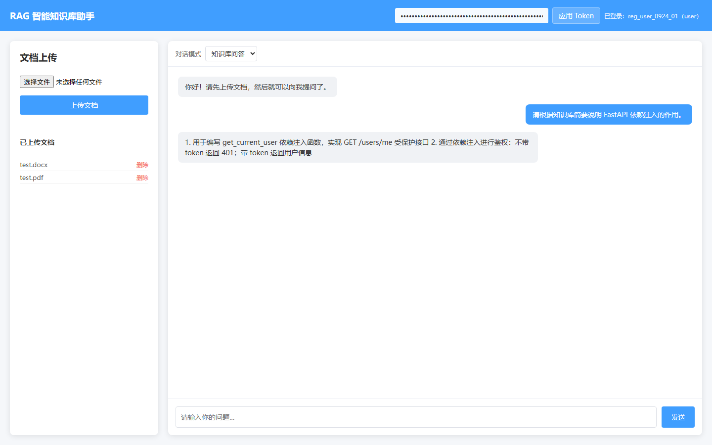
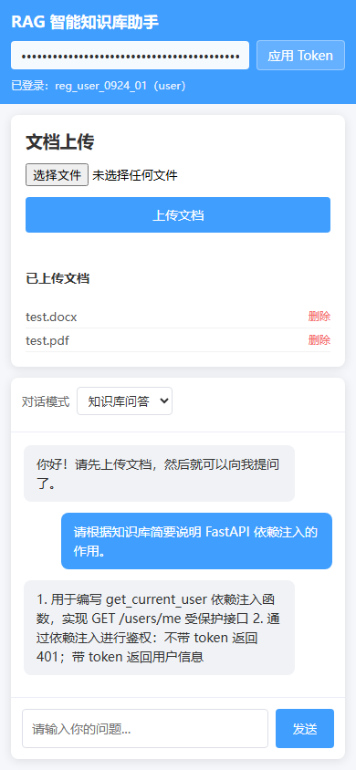
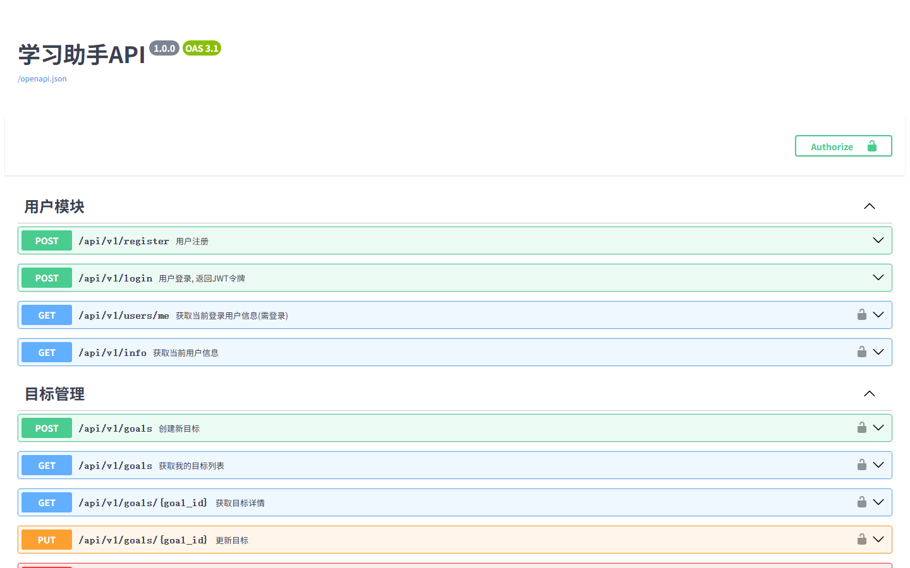
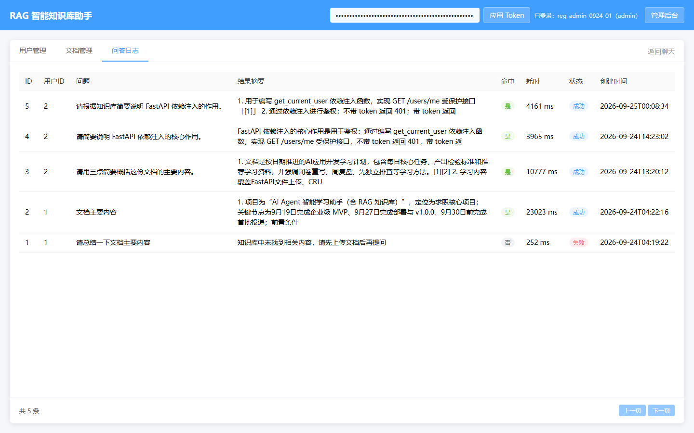
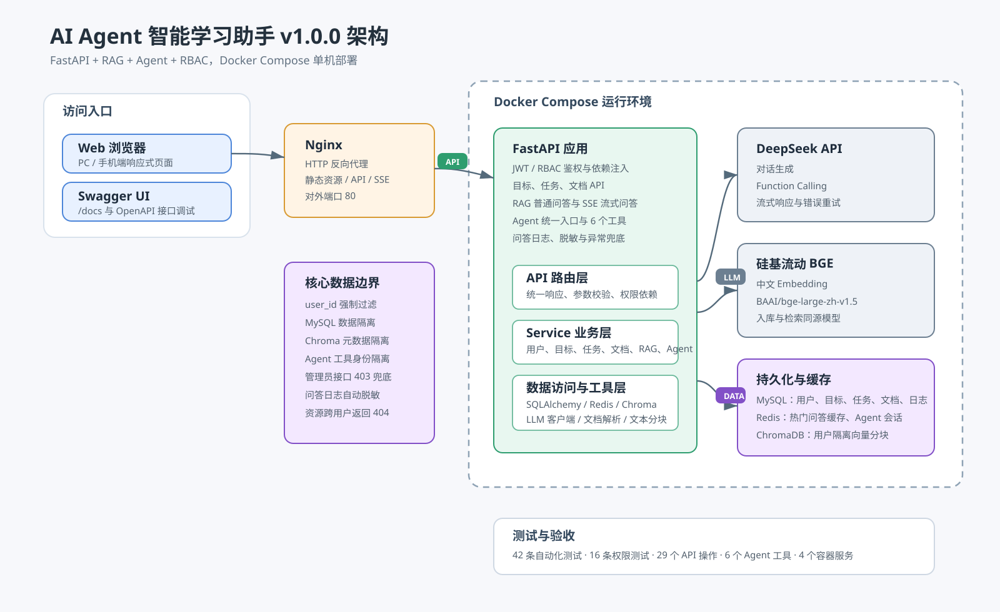

# AI Agent 智能学习助手

基于 FastAPI、RAG、Agent 和多用户数据隔离构建的个人学习助手。项目支持个人知识库问答、学习目标与任务管理、管理员审计、Docker Compose 部署，以及公网 IP + HTTP 面试演示。

当前版本：`v1.0.0`

## 项目背景

传统学习资料通常分散在多个文档中，用户很难围绕个人资料持续问答，也难以把知识检索、学习目标和执行任务连接起来。

本项目将以下能力整合为一个完整应用：

- 用户上传 PDF 或 DOCX，形成个人知识库。
- 使用中文 Embedding 和 ChromaDB 完成向量检索。
- 使用 DeepSeek 生成回答，并通过 SSE 流式返回。
- 使用 Function Calling 让 Agent 创建目标和任务。
- 使用 JWT、RBAC 和用户级元数据实现数据隔离。
- 使用问答日志记录耗时、命中、状态和错误。
- 使用 Docker Compose 一键启动四项基础服务。

## v1.0.0 核心结果

| 指标 | 结果 |
| --- | ---: |
| API 路径 | 22 个 |
| API 操作 | 29 个 |
| 自动化测试 | 42 条 |
| 权限与越权测试 | 16 条 |
| Agent 工具 | 6 个 |
| Docker Compose 服务 | 4 个 |
| 数据隔离层 | MySQL、ChromaDB、Agent 工具 |

## 页面截图

### 桌面端主界面



### 手机端适配



### Swagger API 文档



### 管理员问答日志



## 系统架构



可编辑的 Draw.io 源文件：[`docs/architecture.drawio`](docs/architecture.drawio)

核心请求链路：

```text
浏览器 / Swagger
      |
    Nginx
      |
FastAPI API 路由层
      |
Service 业务层
      |
SQLAlchemy / Redis / ChromaDB / LLM 工具层
      |
MySQL / Redis / ChromaDB / DeepSeek / 硅基流动
```

## 技术栈

| 类型 | 技术 |
| --- | --- |
| Web 框架 | FastAPI、Uvicorn |
| 数据库 | MySQL 8、SQLAlchemy、PyMySQL |
| 数据库迁移 | Alembic |
| 鉴权 | JWT、OAuth2 Password Flow、passlib/bcrypt |
| 向量数据库 | ChromaDB |
| Embedding | 硅基流动 `BAAI/bge-large-zh-v1.5` |
| 大模型 | DeepSeek Chat、Function Calling、流式响应 |
| 缓存与会话 | Redis |
| 文档解析 | PyMuPDF、python-docx |
| 前端 | 原生 HTML、CSS、JavaScript、SSE |
| 测试 | pytest、FastAPI TestClient |
| 部署 | Docker、Docker Compose、Nginx |

## 功能清单

### 用户与权限

- 用户注册、登录和个人资料查询。
- JWT Bearer Token 鉴权。
- `user` 与 `admin` 双角色。
- `401`、`403`、`404` 统一权限处理。
- 管理员接口仅允许管理员访问。

### 学习目标与任务

- 目标和任务的创建、查询、更新与删除。
- 任务可关联目标、优先级、截止时间和完成状态。
- 用户只能操作自己的数据。
- Agent 可通过自然语言创建目标、创建任务和更新任务状态。

### 文档与 RAG

- 上传 PDF 和 DOCX。
- 自动提取正文、清理文本、切分分块。
- 使用 BGE 中文向量模型生成 Embedding。
- 分块、向量和用户元数据写入 ChromaDB。
- 支持普通 RAG 回答和 SSE 流式回答。
- 支持指定文档检索。
- 上传失败时回滚 MySQL 记录。
- 删除文档时同步删除向量分块。

### Agent

当前 Agent 工具包括：

| 工具 | 作用 |
| --- | --- |
| `list_tasks` | 查询当前用户任务 |
| `update_task_status` | 更新当前用户任务状态 |
| `create_goal` | 创建当前用户目标 |
| `create_task` | 创建并关联当前用户任务 |
| `list_goals` | 查询当前用户目标 |
| `search_knowledge_base` | 检索当前用户知识库 |

Agent 使用 Redis 保存多轮会话上下文，并通过统一接口自动选择工具。

### 管理员后台

- 用户列表与邮箱脱敏。
- 文档元数据列表。
- 问答日志列表。
- 日志问题、回答摘要、耗时、命中和状态展示。

## 权限与数据隔离

| 能力 | 普通用户 | 管理员 |
| --- | --- | --- |
| 个人资料 | 仅本人 | 仅本人 |
| 目标、任务、文档 | 仅本人数据 | 仅本人数据 |
| RAG 与 Agent | 仅使用本人数据 | 仅使用本人数据 |
| 管理员用户查询 | 403 | 200 |
| 管理员文档查询 | 403 | 200 |
| 管理员日志查询 | 403 | 200 |

三层隔离：

1. MySQL 查询强制附加 `user_id` 条件。
2. ChromaDB 向量检索强制携带 `user_id` 元数据过滤。
3. Agent 工具从 JWT 获取用户身份，不接受客户端伪造的 `user_id`。

跨用户访问资源时统一返回 `404`，避免暴露资源是否存在。

## 问答日志与可观测性

`qa_logs` 记录：

- 用户 ID。
- 原始问题。
- 回答摘要。
- 总耗时。
- 是否命中知识库。
- 成功或失败状态。
- 错误信息。
- 创建时间。

日志写入前会截断并进行基础脱敏。日志写入失败只记录应用日志，不影响问答主流程。

## 项目结构

```text
fastapi-demo/
├── alembic/                    # 数据库迁移
├── app/
│   ├── api/                    # FastAPI 路由
│   ├── core/                   # 配置、鉴权、异常、日志
│   ├── db/                     # SQLAlchemy 会话
│   ├── models/                 # ORM 模型
│   ├── schemas/                # Pydantic 模型
│   ├── services/               # 业务服务
│   ├── utils/                  # Redis、ChromaDB、LLM、文本处理
│   └── main.py                 # 应用入口
├── deploy/                     # Nginx 配置和部署脚本
├── docs/                       # 架构、验收和演示文档
├── static/index.html           # 演示前端
├── tests/                      # 自动化测试
├── docker-compose.yml
├── Dockerfile
├── .env.example
└── requirements.txt
```

## 本地运行

### 1. 环境要求

- Python 3.12 或兼容版本。
- MySQL 8。
- Redis 7。
- ChromaDB。
- DeepSeek API Key。
- 硅基流动 API Key。

### 2. 安装依赖

```powershell
python -m venv venv
.\venv\Scripts\Activate.ps1
python -m pip install -r requirements.txt
```

### 3. 配置环境变量

```powershell
Copy-Item .env.example .env
```

填写 `.env`：

```dotenv
DEEPSEEK_API_KEY=你的密钥
SILICONFLOW_API_KEY=你的密钥
DB_HOST=localhost
DB_PORT=3306
DB_USER=root
DB_PASSWORD=你的密码
DB_NAME=ai_agent_db
REDIS_HOST=127.0.0.1
REDIS_PORT=6379
REDIS_PASSWORD=你的密码
JWT_SECRET_KEY=你的随机密钥
CHROMA_HOST=localhost
CHROMA_PORT=8001
```

不要把 `.env` 提交到 Git。

### 4. 初始化数据库

```powershell
.\venv\Scripts\alembic.exe upgrade head
```

### 5. 启动应用

```powershell
.\venv\Scripts\uvicorn.exe app.main:app --reload
```

访问：

- 演示页面：`http://127.0.0.1:8000/static/index.html`
- API 文档：`http://127.0.0.1:8000/docs`

## Docker Compose 部署

### 1. 准备配置

```powershell
Copy-Item .env.example .env
```

填写数据库密码、Redis 密码、JWT 密钥、DeepSeek Key 和硅基流动 Key。

### 2. 启动全部服务

```powershell
docker compose up -d --build
docker compose ps
```

Compose 包含：

| 服务 | 容器端口 | 宿主机端口 |
| --- | ---: | ---: |
| FastAPI | 8000 | 8000 |
| MySQL | 3306 | 3307 |
| Redis | 6379 | 6379 |
| ChromaDB | 8000 | 8001 |

FastAPI 会等待 MySQL、Redis 和 ChromaDB 健康后再启动，并自动执行 Alembic 迁移。

### 3. 停止服务

```powershell
docker compose down
```

如需清空数据卷：

```powershell
docker compose down -v
```

## 公网 IP + HTTP 部署

项目面试演示可以不购买域名，直接使用：

```text
http://服务器公网IP/
```

推荐部署方式：

1. 云服务器安全组开放 `22` 和 `80`，`8000` 仅开放给必要来源或服务器内部。
2. 安装 Docker、Docker Compose 和 Git。
3. 拉取代码并配置 `.env`。
4. 执行：

```bash
bash deploy/deploy.sh
```

5. 使用 `deploy/nginx-ip.conf.example` 配置 Nginx。
6. 重载 Nginx：

```bash
sudo nginx -t
sudo systemctl reload nginx
```

验证：

```bash
curl -I http://服务器公网IP/
curl -I http://服务器公网IP/docs
curl -I http://服务器公网IP:8000/docs
```

HTTP 仅用于个人演示。生产环境应补充域名、HTTPS、限流、备份和告警。

## 演示说明

完整面试演示流程见 [`docs/演示说明.md`](docs/演示说明.md)。

推荐 5 至 8 分钟演示顺序：

1. Token 登录与角色显示。
2. 上传测试文档。
3. RAG 流式问答。
4. 学习管家创建目标与任务。
5. 管理员查看用户、文档和问答日志。
6. 展示架构图、测试结果和 Docker Compose 状态。

## 主要接口

| 方法 | 路径 | 说明 |
| --- | --- | --- |
| POST | `/api/v1/register` | 用户注册 |
| POST | `/api/v1/login` | 用户登录 |
| GET | `/api/v1/users/me` | 当前用户 |
| POST/GET | `/api/v1/goals` | 创建或查询目标 |
| POST/GET | `/api/v1/tasks` | 创建或查询任务 |
| POST | `/api/v1/files/upload` | 上传并解析文档 |
| GET | `/api/v1/files` | 查询当前用户文档 |
| POST | `/api/v1/rag/ask` | 普通 RAG 问答 |
| POST | `/api/v1/rag/ask/stream` | SSE 流式问答 |
| POST | `/api/v1/agent/chat` | Agent 统一对话 |
| GET | `/api/v1/admin/users` | 管理员查询用户 |
| GET | `/api/v1/admin/documents` | 管理员查询文档 |
| GET | `/api/v1/admin/qa-logs` | 管理员查询日志 |

## 测试与验收

执行全部测试：

```powershell
.\venv\Scripts\python.exe -m pytest -o addopts='' -q
```

当前结果：

```text
42 passed
```

测试覆盖：

- 注册、登录、当前用户。
- 目标、任务、文档上传和删除。
- RAG 与 Agent 主链路。
- `401`、`403`、`404` 和跨用户越权。
- Agent 工具用户隔离。
- 日志失败不影响问答。
- 上传失败回滚。
- 环境变量、Alembic 和 Docker Compose 配置。
- 前端移动端布局与管理员日志入口。

发布记录见 [`docs/9月27日发布验收记录.md`](docs/9月27日发布验收记录.md)。

## 简历量化数据

见 [`docs/简历量化数据.md`](docs/简历量化数据.md)。

推荐项目描述：

> 基于 FastAPI、MySQL、Redis 和 ChromaDB 构建 AI Agent 智能学习助手，实现 RAG 流式问答、6 个 Agent 工具、JWT + RBAC 权限体系和三层用户数据隔离；完成 29 个 API 操作、42 条自动化测试和 Docker Compose 四服务部署。

## 当前边界

- 面试版本使用公网 IP 和 HTTP，不包含域名与 HTTPS。
- 未做 QPS 压测，不将功能回归耗时表述为并发性能。
- 当前为单机部署，不包含微服务、分布式向量库和消息队列。
- Agent 工具数量为 6 个，不把框架内置能力计入自研工具。

## License

仅用于个人学习、求职展示和技术交流。
